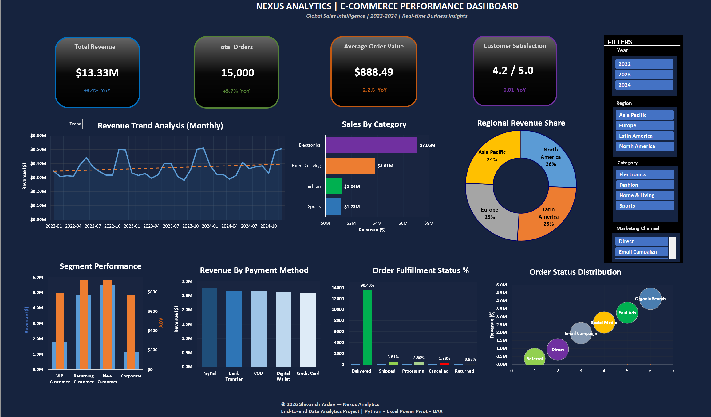

# 📊 Nexus Analytics | E-Commerce Performance Dashboard


## 🔹 Project Overview
**Nexus Analytics** is a data analytics and dashboarding project designed to demonstrate
end-to-end analytical thinking, KPI design, and business insight generation using
e-commerce sales data.

This repository serves as a **personal analytics portfolio project** and is intended
strictly for **educational and practice purposes**.

---

## 👤 Ownership & Usage
- **Project Owner:** Shivansh Yadav  
- **Purpose:** Educational, learning, and portfolio demonstration  
- **Usage Rights:**  
  This project and its contents may be referenced or used for **practice and learning**.
  Commercial usage or misrepresentation of ownership is not permitted.

---

## 🎯 Project Objectives
- Analyze e-commerce sales performance across time, region, category, and customer segments
- Design meaningful business KPIs for executive-level reporting
- Build a scalable dashboard blueprint before implementation
- Practice structured problem-solving used in real analytics roles

---

## 📂 Repository Structure
```
portfolio/
│── app.py                     # Streamlit portfolio application
│── requirements.txt           # Python dependencies
│── README.md                  # Project documentation
│── Problem_Statement.pdf      # Business problem definition
│── Solution_Guidelines.pdf    # Planned analytical approach
│
├── data/
│   ├── ecommerce_sales_data.csv
│   └── README.md              # Dataset description
│
├── images/
│   └── Nexus_Dashboard.png
```

---

## 📊 Dataset Information
- **File:** `ecommerce_sales_data.csv`
- **Records:** ~15,000 transactions
- **Time Period:** 2022 – 2024
- **Data Type:** Synthetic / programmatically generated
- **Usage:** Analytics, KPI calculation, dashboard development

> Note: The dataset is **synthetic** and created solely for analytical practice and
portfolio demonstration.

---

## 🖼️ Dashboard Preview
The following image represents the **final dashboard** developed for this project, showcasing:
- Key Performance Indicators (KPIs)
- Sales & Category Performance
- Regional & Customer Insights



---

## 🛠️ Planned Tech Stack
- **Python**
- **Streamlit**
- **Pandas & NumPy**
- **Matplotlib / Plotly**
- **Excel & BI concepts (for KPI design reference)**

---

## 🧠 Key KPIs (Planned)
- Total Revenue
- Total Orders
- Average Order Value (AOV)
- Customer Satisfaction Score
- Revenue by Category & Region
- Order Fulfillment Status
- Channel Performance Efficiency

---

## 🚀 Current Project Status
- ✅ Problem Definition Completed
- ✅ Solution Planning Completed
- ✅ Dashboard Design & Implementation
- ✅ Data Cleaning & Processing
- ✅ KPI Computation
- ✅ Interactive Dashboard Development

---

## 🎓 Learning Outcomes
This project is designed to strengthen:
- Analytical thinking
- Business-oriented KPI design
- Data storytelling
- Dashboard planning before execution
- Portfolio-quality documentation

---

## 📌 Disclaimer
This project:
- Represents a **fictional business scenario**
- Uses **synthetic data**
- Is created **solely for educational and practice purposes**
- Should not be interpreted as real company data or insights

---

## 📬 Contact
For feedback or collaboration:
- **GitHub:** https://github.com/Venom-Shivu

---

**⭐ If you find this project useful for learning or practice, feel free to star the repository.**
